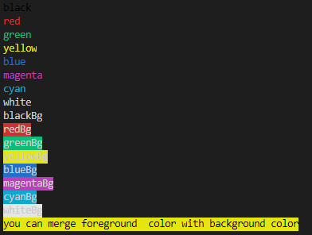

[](https://github.com/csharp-opensource/ConsoleColorsExtension/actions/workflows/nugetPublish.yml)

# Install

```bash
Install-Package CSharpExtensions.OpenSource.ConsoleColors
# or
dotnet add package CSharpExtensions.OpenSource.ConsoleColors
```



# Use

```c#
using CSharpExtensions.OpenSource.ConsoleColors;

public static void Main(string[] args)
{
    Console.WriteLine("text".ColorByNumber(30)); // equals, 30 = black in ansi colors
    Console.WriteLine("black".Black());
    Console.WriteLine("red".Red());
    Console.WriteLine("green".Green());
    Console.WriteLine("yellow".Yellow());
    Console.WriteLine("blue".Blue());
    Console.WriteLine("magenta".Magenta());
    Console.WriteLine("cyan".Cyan());
    Console.WriteLine("white".White());
    Console.WriteLine("blackBg".BlackBg());
    Console.WriteLine("redBg".RedBg());
    Console.WriteLine("greenBg".GreenBg());
    Console.WriteLine("yellowBg".YellowBg());
    Console.WriteLine("blueBg".BlueBg());
    Console.WriteLine("magentaBg".MagentaBg());
    Console.WriteLine("cyanBg".CyanBg());
    Console.WriteLine("whiteBg".WhiteBg());

    Console.WriteLine("you can merge foreground  color with background color".Black().YellowBg());
}
```

# https://www.nuget.org/packages/CSharpExtensions.OpenSource.ConsoleColors/
